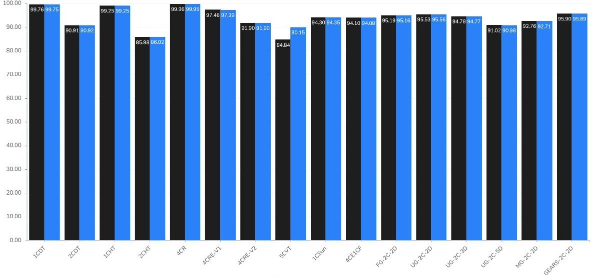

# SCARGC.jl

A Julia implementation of **S**tream **C**lassification **A**lgo**r**ithm **G**uided by **C**lustering – **SCARGC** -, an algorithm to classify data streams in nonstationary environments with extreme verification latency. The considered scenario is the one where the actual labels of unlabeled data are never available as a guidance to update the classification model over time.

Documentation | Build
------------- | ----- 
[](https://MarinhoGabriel.github.io/SCARGC.jl/dev) | [](https://travis-ci.com/MarinhoGabriel/SCARGC.jl) [](https://coveralls.io/github/MarinhoGabriel/SCARGC.jl) [](https://codecov.io/gh/MarinhoGabriel/SCARGC.jl)


## Installation

In Julia terminal, you can use

```julia
using Pkg
Pkg.add("SCARGC")
```

or, if you prefer, you can use the Julia REPL

```julia-repl
(@v1.4)> add SCARGC
```

## Comparison

Between the Julia implementation of SCARGC and the original one, implemented in MatLab, the results were pretty good.
The following picture shows the comparison between SCARGC.jl (in black) and SCARGG.



## References

- Stream Classification Algorithm Guided by Clustering - SCARGC
  - [Souza, V. M. A.; Silva, D. F.; Gama, J.; Batista, G. E. A. P. A.: **Data Stream Classification Guided by Clustering on Nonstationary Environments and Extreme Verification Latency**. SIAM International Conference on Data Mining (SDM), pp. 873-881, 2015](https://repositorio.inesctec.pt/bitstream/123456789/5325/1/P-00K-AN4.pdf)


[docs-stable-img]: https://img.shields.io/badge/docs-stable-blue.svg
[docs-stable-url]: https://
